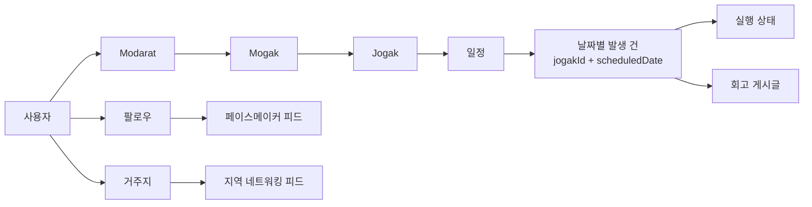

# MOGAK Core Backend

> 계획한 자기계발을 꾸준히 실행하고, 회고와 네트워킹으로 이어 가는 MOGAK 서비스의 NestJS 백엔드

[서비스 소개](#서비스-소개) · [도메인](#도메인-모델) · [설계-결정](#핵심-설계-결정) · [시작하기](#로컬에서-시작하기) · [검증](#검증) · [문서](#문서)

## 서비스 소개

MOGAK은 카테고리와 반복 일정을 가진 자기계발 목표를 만들고, 매일의 실행과 회고를 기록하는 서비스입니다. 다른 사용자를 팔로우해 페이스메이커의 회고를 확인하거나, 기본 거주지를 기준으로 지역 네트워킹 피드를 탐색할 수 있습니다.

이 저장소는 기존 Spring API의 서비스 의도를 유지하면서 NestJS·TypeScript·PostgreSQL로 백엔드를 재구축하는 프로젝트입니다. 기존 운영 데이터는 이전하지 않으며, 구·신 서버의 이중 쓰기도 하지 않습니다.

## 도메인 모델



- **Modarat**: 사용자가 만든 상위 묶음입니다.
- **Mogak**: 카테고리·색상을 가진 자기계발 목표입니다.
- **Jogak**: Mogak 안에서 실행할 구체적인 할 일과 반복 일정입니다.
- **날짜별 발생 건**: 일정으로부터 계산되는 그날의 Jogak입니다. 앱에서는 `jogakId + scheduledDate`로 발생 건을 선택하고, 실행 상태가 바뀔 때만 `executionId`를 PK로 가진 실제 실행 기록을 저장합니다.
- **회고 게시글**: 특정 Jogak과 날짜에 연결되는 기록이며, 댓글과 좋아요를 가질 수 있습니다.

## 핵심 설계 결정

| 주제           | 기존 문제                                                             | 현재 결정                                                                                   |
| -------------- | --------------------------------------------------------------------- | ------------------------------------------------------------------------------------------- |
| 날짜별 Jogak   | 매일 배치가 `DailyJogak` 행을 미리 만들어 기간에 비례해 데이터가 증가 | 일정에서 발생 건을 계산하고, 실행 저장 시 `UNIQUE (jogak_id, scheduled_date)`로 중복만 방지 |
| 실행 상태      | 동시 생성·재호출 시 중복과 상태 경합 가능성                           | 최소 UNIQUE 제약과 `ON CONFLICT DO NOTHING`·조건부 update로 멱등 처리                       |
| 좋아요·댓글 수 | 저장 카운터와 비관적 락에 정합성이 의존                               | 원본 행에서 집계해 stale 카운터와 넓은 쓰기 락 제거                                         |
| 회원 탈퇴      | 복구 기능 없는 soft delete와 수동 삭제 순서                           | 관계를 따라 정리되는 hard delete                                                            |
| 로그인 세션    | 사용자당 refresh token 하나로 동시 로그인 제한                        | `auth_sessions` 기반 다중 기기 세션과 refresh token 회전                                    |
| 입력 검증      | 요청 경계별 검증 규칙이 분산                                          | Zod와 Nest 어댑터로 Body·Query·Path Parameter를 strict 검증                                 |

## 기술 구성

| 영역              | 선택                       |
| ----------------- | -------------------------- |
| Runtime           | Node.js 24, TypeScript     |
| Framework         | NestJS 11                  |
| Database          | PostgreSQL 17, Drizzle ORM |
| Validation        | Zod, `nestjs-zod`          |
| Test              | Jest, Supertest            |
| Local environment | pnpm, Docker Compose       |

## 로컬에서 시작하기

### 요구 사항

- Node.js : `24.18.x`
- pnpm : `10.32.x`
- Docker 및 Docker Compose

### 1. 환경 변수 생성

```bash
cp .env.example .env
```

`.env`에서 아래 값을 개발 환경에 맞게 바꿉니다.

- `MOGAK_DB_PASSWORD`와 `DATABASE_URL`의 비밀번호는 동일해야 합니다.
- `JWT_SECRET`은 32자 이상이어야 합니다.
- `APPLE_CLIENT_IDS`, `GOOGLE_CLIENT_IDS`는 기동 시 필수입니다. 실제 소셜 로그인에는 각 앱의 client ID가 필요합니다.

### 2. PostgreSQL 실행과 migration 적용

```bash
docker compose up -d postgres
pnpm install
pnpm db:migrate
pnpm start:dev
```

서버는 기본적으로 `http://localhost:8080`에서 기동합니다.

```bash
curl http://localhost:8080/health
# {"status":"ok"}
```

## API 사용 규칙

- 보호 API에는 `Authorization: Bearer <accessToken>`을 보냅니다.
- 토큰 갱신은 `POST /api/auth/refresh`와 `RefreshToken` 헤더를 사용합니다. refresh token은 매번 회전하므로 access·refresh token을 함께 교체해야 합니다.
- 성공 응답의 데이터는 기존 `BaseResponse` 형식의 `result`에 들어갑니다.
- 요청 Body·Query·Path Parameter는 strict 검증됩니다. 정의되지 않은 이전 필드를 함께 보내지 않습니다.
- 날짜별 Jogak은 `dailyJogakId` 대신 `jogakId + scheduledDate`로 선택합니다. 저장된 실행 행의 PK는 `executionId`이며, 게시글은 서버가 이 실행 행을 연결합니다.

주요 API 영역은 다음과 같습니다.

| 영역     | 예시 경로                                                                           |
| -------- | ----------------------------------------------------------------------------------- |
| 인증     | `POST /api/auth/login`, `POST /api/auth/{provider}/login`, `POST /api/auth/refresh` |
| 사용자   | `POST /api/users/join`, `GET /api/users/profile`                                    |
| 모각     | `/api/modarats`, `/api/mogaks`, `/api/jogaks`                                       |
| 회고     | `POST /api/jogaks/{jogakId}/posts`, `/api/posts`                                    |
| 네트워킹 | `/api/users/follows/{nickname}`, `/api/posts/pacemakers`                            |

## 검증

```bash
pnpm format:check
pnpm lint
pnpm typecheck
pnpm build
pnpm test --runInBand
pnpm test:e2e --runInBand
pnpm test:db --runInBand
```

`test:db`는 `.env`의 연결 정보를 바탕으로 `MOGAK_TEST_DB` 전용 데이터베이스에 migration을 적용한 뒤 실행합니다. 테스트 데이터베이스 이름은 반드시 `_test`로 끝나야 합니다. 로컬 Docker Compose를 처음 기동하면 테스트 DB도 함께 생성됩니다.

## 문서

- [NestJS 마이그레이션 설계 및 인수인계](docs/migration/2026-07-23-nestjs-migration-handoff.md)
- [기존 Spring 서버](https://github.com/Team-MOGAK/MOGAK_Spring)
